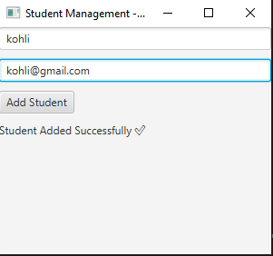
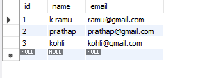

# 🎓 Student Management System (JavaFX + MySQL)

A desktop-based Student Management System built using **JavaFX** and **MySQL**.  
This application performs full CRUD operations with a clean UI and database integration.

---

## 🚀 Features

- ✅ Add Student  
- ✅ Display Students using TableView  
- ✅ MySQL Database Integration  

---

## 🛠 Technologies Used

- Java 21  
- JavaFX 21  
- MySQL  
- JDBC  
- Eclipse IDE  

---

## 📂 Project Structure
```
StudentFXApp
└── src
└── application
     ├── Main.java
     ├── DBConnection.java
```

---

## 🗄 Database Setup

Run the following SQL script in MySQL Workbench:

```sql
CREATE DATABASE student_fx_db;
USE student_fx_db;

CREATE TABLE student (
    id INT PRIMARY KEY AUTO_INCREMENT,
    name VARCHAR(50),
    email VARCHAR(100)
);
```

⚙️ How to Run the Project
1️⃣ Add MySQL Connector JAR

Right click project
Build Path → Configure Build Path
Libraries → Add External JARs
Select mysql-connector-j-8.x.x.jar

2️⃣ Add JavaFX SDK

Download JavaFX SDK
Add all JAR files inside javafx-sdk/lib to Build Path

3️⃣ Add VM Options

Go to:
Run → Run Configurations → Arguments → VM Arguments

Add:
```
--module-path "path_to_javafx_lib" --add-modules javafx.controls,javafx.fxml
```
4️⃣ Run Main.java

Application Screenshots
🔹 Main Application UI
<p align="center">  </p>
🔹 Database Output View
<p align="center">  </p>

# future Enchancements:
TableView 
to display students
Delete button
Update feature
Search student
CSS styling

Author
Ramu K
B.Tech Student | Java Backend Learner
Focused on Java, Spring Boot, and Database Development


---
Commit and push:

```bash
git add .
git commit -m "Updated README with images"
git push
